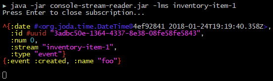

# Eventful

Eventful is an [EventStoreDB](https://eventstore.com/) client library which wraps
around the [JVM Client](https://github.com/EventStore/EventStore.JVM) (TCP
interface).

It provides (hopefully) Clojure-friendly functions to work with the Event Store
and covers (almost) all of the API of the JVM Client.

[](https://clojars.org/eventful)

## Demo

[Console Stream Reader](demo/console-stream-reader):

[](demo/console-stream-reader)

## Documentation

- [A Quick but Eventful Tutorial](https://PawelStroinski.github.io/eventful/tutorial.html)
- [API Docs](https://PawelStroinski.github.io/eventful/eventful.core.html)

## Usage

This small example demonstrates writing and reading an event:

```clojure
(ns eventful.hello-world
  (:require [eventful.core :refer [connect write-events read-event]]))

(let [conn (connect {:hostname "127.0.0.1" :port 1113
                     :login    "admin"     :password "changeit"})]
  @(write-events {:conn conn :stream "inventory-item-1" :exp-ver :no-stream}
                 {:event :created :name "foo"})
  (prn @(read-event {:conn conn :stream "inventory-item-1"} 0)))
```

## Roadmap

* Consider switching Eventful to the [new official Java client](https://github.com/EventStore/EventStoreDB-Client-Java) without breaking the API.

## Not Implemented

* [Projections Client (HTTP)](https://eventstore.com/docs/dotnet-api/projections/index.html) - `eventstore.ProjectionsClient`

## License

Copyright © 2020 Paweł Stroiński

Distributed under the Eclipse Public License either version 1.0 or (at
your option) any later version.
